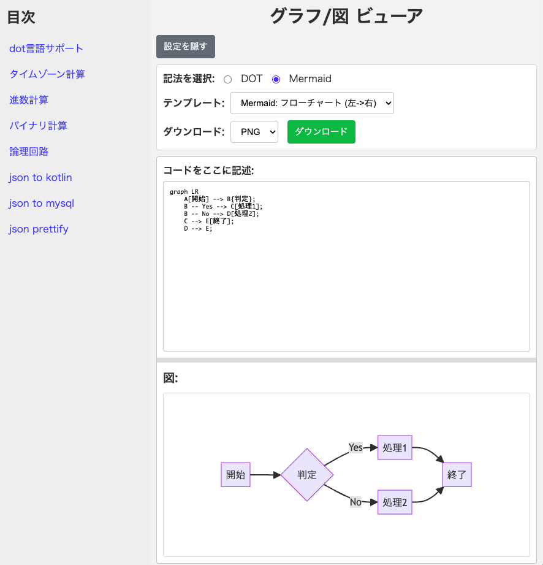

# 便利ツールサイトのご紹介
このサイトは、プログラマーやウェブ開発者、データ処理を行う方々にとって非常に便利なオンラインツールを提供しています。
ソフトウェアのインストールは不要で、ブラウザからアクセスするだけで、様々なユーティリティをすぐに利用できます。

    <a href="https://yoshinag.github.io/calc/" target="_blank" rel="noopener noreferrer" style="display: inline-block; margin: 20px 0; padding: 12px 25px; background-color: #007bff; color: #ffffff; text-decoration: none; border-radius: 5px; font-weight: bold;">
        yoshinag.github.io/calc/ を使ってみる
    </a>

## サイトの構成と使い方
このサイトは、左側に「目次」として利用可能なツールの一覧が並ぶサイドバーがあり、中央の広いエリアに選択したツールが表示されるシンプルなレイアウトです。

1.  [yoshinag.github.io/calc/ にアクセス](https://yoshinag.github.io/calc/)します。
2.  左側のサイドバーにある「目次」から、利用したいツール名をクリックします。
3.  右側のメインエリアに選択したツールが読み込まれ、すぐに使用できます。

## 提供されている主なツール
以下のような便利なツールが用意されています（2024年5月時点）。

*   **バイナリ計算 (binary.html):** 2進数の基本的な演算やビット操作を行えるツールです。
*   **dot言語サポート (dot/dot_viewer.html):** GraphvizのDOT言語などで記述されたグラフ構造を、[Mermaid.js](https://mermaid.js.org/) を利用してブラウザ上で視覚化・表示できます。
    

        
        
図: dot言語ビューア（グラフ/図ビューア）の利用例。Mermaid記法でフローチャートを表示しています。

    

*   **JSON to Kotlin (json_kotlin.html):** JSON形式のデータから、Kotlinのデータクラスの雛形を自動生成します。
*   **JSON to MySQL (json_mysql.html):** JSONデータ構造を元に、MySQLのテーブル定義 (CREATE TABLE文) を生成するのに役立ちます。
*   **JSON Prettify (json_prettify.html):** 整形されていないJSON文字列を、インデントや改行を加えて見やすくフォーマットします。
*   **論理回路 (ronrikairo.html):** AND, OR, NOTなどの基本的な論理ゲートを組み合わせて、簡単な論理回路の動作をシミュレートできます。
*   **進数計算 (number.html):** 2進数、8進数、10進数、16進数など、異なる基数間の数値変換や計算が可能です。

*※ツール一覧は更新される可能性がありますので、最新の情報は公式サイトでご確認ください。*

## こんな方におすすめ
*   **プログラマー・ソフトウェアエンジニア:** データ変換、コード生成、デバッグ時の補助ツールとして。
*   **ウェブ開発者:** JSONデータの整形やAPI連携時のデータ構造確認に。
*   **データベース管理者・設計者:** JSONからテーブルスキーマを検討する際に。
*   **情報系の学生:** 論理回路や進数、バイナリ演算の学習・実験に。
*   **データアナリスト:** データの構造把握や簡単な変換作業に。
*   ちょっとした計算やデータ整形を、手軽にオンラインで行いたい全ての方。

`yoshinag.github.io/calc/` は、開発作業を効率化したり、学習の手助けとなったりする便利なツールが詰まったウェブサイトです。
日常的な作業から専門的なタスクまで、ぜひこのサイトをブックマークしてご活用ください。
